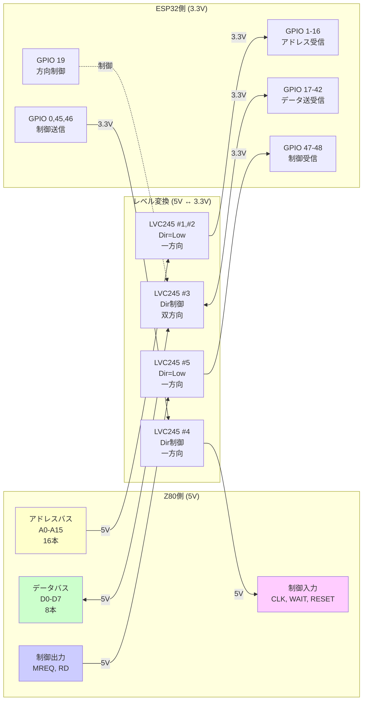
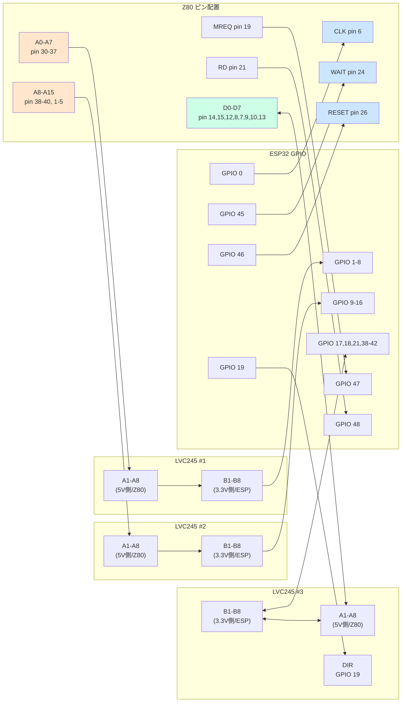
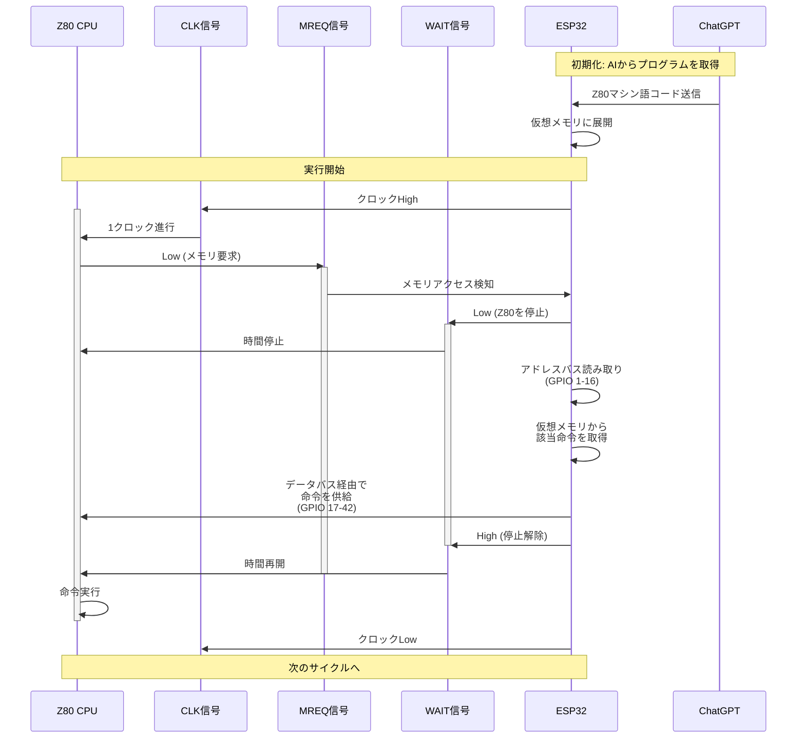
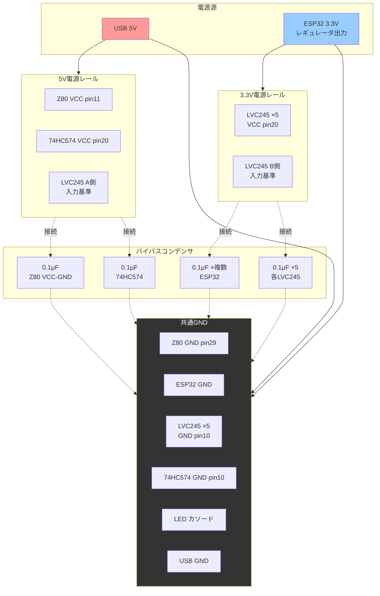
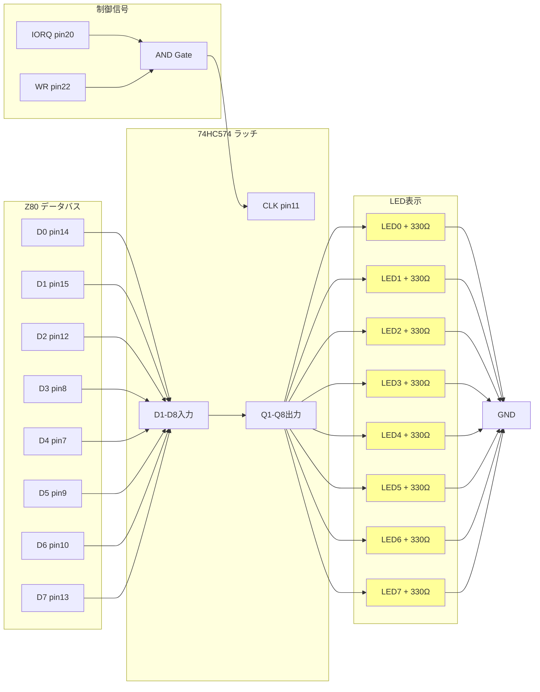
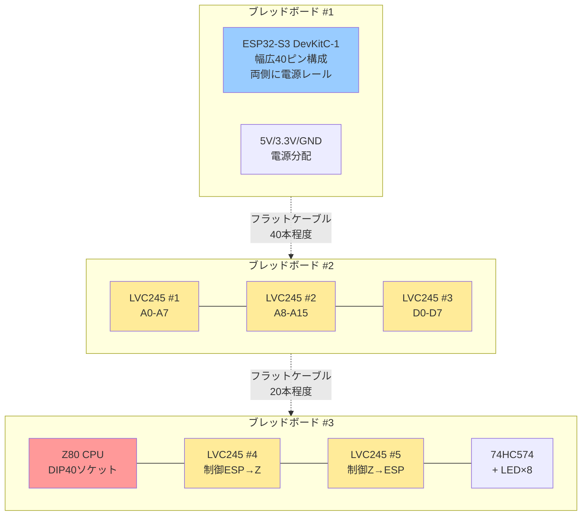
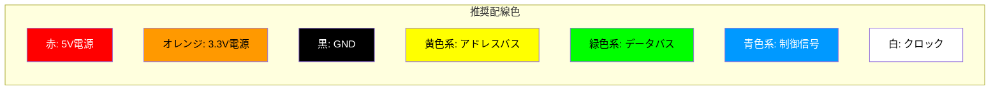

# 老人Z80 回路図 (Mermaid版)

## 1. システム全体構成図

```mermaid
graph TB
    subgraph Power["電源供給系統"]
        USB[USB 5V電源]
        USB --> Z80_VCC[Z80 VCC]
        USB --> HC574_VCC[74HC574 VCC]
        USB --> LVC_A[レベルシフタ A側 5V]

        ESP_3V3[ESP32 3.3V出力]
        ESP_3V3 --> LVC_VCC[レベルシフタ VCC 3.3V]
        ESP_3V3 --> LVC_B[レベルシフタ B側 3.3V]

        GND[共通GND]
    end

    subgraph CPU["Z80 CPU (老人)"]
        Z80[Z84C0008<br/>8MHz CMOS<br/>5V駆動]
    end

    subgraph LevelShift["神経系 (電圧変換)"]
        LVC1[LVC245 #1<br/>A0-A7]
        LVC2[LVC245 #2<br/>A8-A15]
        LVC3[LVC245 #3<br/>D0-D7<br/>双方向]
        LVC4[LVC245 #4<br/>制御信号<br/>ESP→Z80]
        LVC5[LVC245 #5<br/>制御信号<br/>Z80→ESP]
    end

    subgraph MCU["ESP32 (介護士)"]
        ESP[ESP32-S3<br/>DevKitC-1<br/>N16R8<br/>3.3V駆動]
    end

    subgraph Output["出力系 (脈動)"]
        HC574[74HC574<br/>ラッチ]
        LED[LED×8<br/>バイタルサイン]
    end

    subgraph Cloud["AI (意識)"]
        ChatGPT[ChatGPT API<br/>プログラム生成]
    end

    Z80 -->|アドレスバス<br/>A0-A7| LVC1
    Z80 -->|アドレスバス<br/>A8-A15| LVC2
    Z80 <-->|データバス<br/>D0-D7| LVC3
    Z80 <-->|制御信号| LVC4
    Z80 -->|MREQ, RD| LVC5

    LVC1 -->|GPIO 1-8| ESP
    LVC2 -->|GPIO 9-16| ESP
    LVC3 <-->|GPIO 17-42| ESP
    LVC4 <-->|CLK(0), WAIT, RESET| ESP
    LVC5 -->|GPIO 47-48| ESP

    Z80 -->|データ出力| HC574
    HC574 --> LED

    ESP -->|Wi-Fi| ChatGPT

    style Z80 fill:#ff9999
    style ESP fill:#99ccff
    style LVC1 fill:#ffeb99
    style LVC2 fill:#ffeb99
    style LVC3 fill:#ffeb99
    style LVC4 fill:#ffeb99
    style LVC5 fill:#ffeb99
    style ChatGPT fill:#99ff99
```

## 2. データフロー詳細図



## 3. ピンアサイン詳細マップ



## 4. 仮想メモリ動作シーケンス



## 5. タイミングチャート

```mermaid
%%{init: {'theme':'base'}}%%
gantt
    title Z80 仮想メモリ読み出しタイミング
    dateFormat X
    axisFormat %L

    section CLK (GPIO 0)
    High   :a1, 0, 100
    Low    :a2, 100, 100
    High   :a3, 200, 100

    section MREQ (Z80→47)
    High   :b1, 0, 50
    Low    :b2, 50, 150
    High   :b3, 200, 100

    section WAIT (45→Z80)
    High   :c1, 0, 60
    Low    :c2, 60, 100
    High   :c3, 160, 140

    section Address (Z80→1-16)
    Invalid:d1, 0, 50
    Valid  :crit, d2, 50, 150
    Invalid:d3, 200, 100

    section Data (17-42)
    HiZ    :e1, 0, 100
    Valid  :crit, e2, 100, 60
    HiZ    :e3, 160, 140

    section DIR (GPIO 19)
    Low    :f1, 0, 100
    High   :f2, 100, 60
    Low    :f3, 160, 140
```



## 6. 電源配線図



## 7. LED出力回路



## 8. ブレッドボード配置図



## 9. パスコン（バイパスコンデンサ）配置

各ICのVCC-GND間に0.1μFセラミックコンデンサを**できるだけ近く**に配置する。

| IC | 電源電圧 | パスコン容量 | 数量 | 配置位置 |
|----|---------|------------|------|---------|
| Z80 CPU | 5V | 0.1μF | 1個 | pin11-pin29間 |
| 74HC574 | 5V | 0.1μF | 1個 | pin20-pin10間 |
| LVC245 #1 | 3.3V | 0.1μF | 1個 | pin20-pin10間 |
| LVC245 #2 | 3.3V | 0.1μF | 1個 | pin20-pin10間 |
| LVC245 #3 | 3.3V | 0.1μF | 1個 | pin20-pin10間 |
| LVC245 #4 | 3.3V | 0.1μF | 1個 | pin20-pin10間 |
| LVC245 #5 | 3.3V | 0.1μF | 1個 | pin20-pin10間 |
| ESP32-S3 | 3.3V | 0.1μF | 2-3個 | 各3.3V-GND間（複数箇所） |
| ESP32-S3 | 3.3V | 10μF | 1個 | 3.3V-GND間（バルク用） |

**合計必要数: 0.1μF × 9個、10μF × 1個**

## 10. 配線色コーディング


